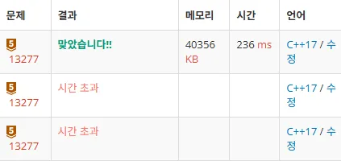

import Callout from '@/components/Callout.astro'

## Introduction
수포자인 나는 백준에서 [큰 수 곱셈 13277 (Bronze)](https://www.acmicpc.net/problem/13277) 날먹 문제를 찾고
풀려고 시도했지만 생각보다 매우 큰 수 였다... 시간초과가 발생했다.
그러다가 [카라추바 알고리즘](https://ko.wikipedia.org/wiki/카라추바_알고리즘)을 찾게 되었고 이걸 구현하여 시도했지만
또 시간초과가 발생하였다. 다른 알고리즘인 `FFT 알고리즘`을 찾았지만... 매우 어려워서 미래의 나를 위해 지금 공부한걸
적어볼려고 한다.

## Why Use FFT Algorithm?

FFT 알고리즘을 사용하는 이유는 간단하다. **엄청 빠르다 !!!**
- 기본적인 곱셈 알고리즘: $O(N^2)$
- 카라추바 알고리즘: $O(n^{1.585})$
- FFT 알고리즘: $O(n \log n)$
<Callout variant="explanation" title="초간단하게설명한FFT알고리즘">
 간?단?하게 설명하자면 FFT 알고리즘은 숫자를 **다항식**으로 만든다음 
 
 계수를 **단위근**을 이용한 **점-값 표현**으로 만든다음 점-값 곱셈을 하고 다시 계수로 바꾸는 것
</Callout>

여기서 잠깐!!!
이때 단위근이랑 점-값 표현이 나오는데 난 잘 모르니 설명을 해보겠다.

### Unit Root
단위근은 FFT 알고리즘의 핵심입니다.
간단하게 설명하자면 **n제곱근**이라고 하고 **원 위의 점들**입니다.

<Callout variant="definition" title="단위근 설명">
 **단위근 (Unit Root)**: n제곱하면 1이 되는 복소수들로, 복소평면에서 원점 중심 반지름 1인 원 위의 점들

 k번째 n차 단위근: ω^k = $cos(2πk/n) + i×sin(2πk/n)$
</Callout>

<Callout variant="important" title="FFT에 사용되는 단위근의 성질">
1. 대칭성
> $ω^{n/2} = -1$
>
> $ω^{(k+n)/2} = -ω^{k}$

이 성질을 이용해 계산을 절반으로 줄일 수 있습니다.
<Callout variant="example" title="FFT 분할정복에서 대칭성 활용">
```cpp
// 다항식 P(x) = a₀ + a₁x + a₂x² + a₃x³ + a₄x⁴ + a₅x⁵ + a₆x⁶ + a₇x⁷
// 짝수 차수: P_even(x) = a₀ + a₂x + a₄x² + a₆x³
// 홀수 차수: P_odd(x) = a₁ + a₃x + a₅x² + a₇x³

// 8차 단위근에서 계산:
P(ω⁰) = P_even(ω⁴⁰) + ω⁰ × P_odd(ω⁰)
P(ω¹) = P_even(ω⁴¹) + ω¹ × P_odd(ω¹)
P(ω²) = P_even(ω⁴²) + ω² × P_odd(ω²)
P(ω³) = P_even(ω⁴³) + ω³ × P_odd(ω³)

// 대칭성 활용 (ω⁴ = -ω⁰): 부호만 바뀜 !
P(ω⁴) = P_even(ω⁰) - ω⁸⁴ × P_odd(ω⁰)
P(ω⁵) = P_even(ω⁴¹) - ω¹ × P_odd(ω¹)
P(ω⁶) = P_even(ω⁴²) - ω² × P_odd(ω²)
P(ω⁷) = P_even(ω⁴³) - ω³ × P_odd(ω³)
```
</Callout>

2. 제곱 관계
> $(ω_n^k)² = ω_{n/2}^k$

이 성질을 이용해 분할정복을 할 수 있습니다.

<Callout variant="example" title="8차 단위근에서 4차 단위근으로 축소되는 과정">
```cpp
// 8차 단위근들 (ω⁸ = 1)
ω⁰ = 1
ω¹ = cos(45°) + i×sin(45°) = (√2/2) + i×(√2/2)
ω² = cos(90°) + i×sin(90°) = i
ω³ = cos(135°) + i×sin(135°) = (-√2/2) + i×(√2/2)
ω⁴ = cos(180°) + i×sin(180°) = -1
ω⁵ = cos(225°) + i×sin(225°) = (-√2/2) - i×(√2/2)
ω⁶ = cos(270°) + i×sin(270°) = -i
ω⁷ = cos(315°) + i×sin(315°) = (√2/2) - i×(√2/2)

// 이들을 제곱하면:
(ω⁰)² = 1 = ω⁰
(ω¹)² = i = ω¹
(ω²)² = -1 = ω²
(ω³)² = -i = ω³
(ω⁴)² = 1 = ω⁰   // 반복 !
(ω⁵)² = i = ω¹   // 반복 !
(ω⁶)² = -1 = ω²  // 반복 !
(ω⁷)² = -i = ω³  // 반복 !
```
</Callout>

<Callout variant="note">
단위근의 **제곱 관계**와 **대칭성** 덕분에 FFT에서 계산을 재활용할 수 있어서 

$O(n^2)$ → $O(n \log n)$으로 시간복잡도가 개선됩니다.

</Callout>

</Callout>

### Point-Value Representation

<Callout variant="definition" title="점-값 설명">
점-값 표현: 다항식을 여러 점에서의 함수값들로 나타내는 방법

`P(x) = [(x₀, P(x₀)), (x₁, P(x₁)), (x₂, P(x₂)), ..., (xₙ₋₁, P(xₙ₋₁))]`
</Callout>

<Callout variant="explanation" title="다항식의 두가지 표현 방법">
숫자를 다항식으로 만들때 다항식을 표현하는 방법이 2가지 있습니다.
1. 계수 표현 (Coefficient Representation)
<Callout variant="example" title="계수 표현 예시">
P(x) = 2 + 3x + 4x² + 5x³

- 계수 표현: [2, 3, 4, 5]
</Callout>

2. 점-값 표현 (Point-Value Representation)
<Callout variant="example" title="점-값 표현 예시">
P(x) = 2 + 3x + 4x² + 5x³을 4개 점에서 계산:

- 점-값 표현: [(1, 14), (2, 64), (3, 182), (4, 398)]
</Callout>
이때 왜 FFT 알고리즘은 점-값 표현을 사용하냐면

점-값 표현이 다항식 곱셈의 시간 복잡도가 더 작기 때문입니다.

<Callout variant="note" title="다항식 곱셈의 시간복잡도">
- 계수 표현: $O(n^2)$ - 모든 계수끼리 곱하고 더해야 함
- 점-값 표현: $O(n)$ - 각 점에서 값만 곱하면 됨
</Callout>
</Callout>

## Cooley-Tukey FFT Algorithm
Cooley-Tukey FFT는 가장 널리 사용되는 FFT(F) 알고리즘이다,
분할정복 방식을 통해 O(n²) → O(n log n)으로 시간복잡도를 개선해줍니다.

이제 Cooley-Tukey FFT의 과정을 8단계로 나눠 설명해보겟습니다.

### Cooley-Tukey FFT 과정

<Callout variant="note">
1. 입력 데이터 준비: 문자열의 큰 수를 복소수 벡터로 변환

2. 배열 크기 2의 거듭제곱으로 확장: FFT 알고리즘이 효율적으로 작동하기 위해 배열 크기를 2의 거듭제곱으로 맞춤

3. 계수를 다항식 형태로 배치: 숫자를 다항식 계수로 변환하여 낮은 차수가 배열 앞쪽에 오도록 배치

4. 비트 역순 정렬: 분할정복 과정을 반복적으로 구현하기 위해 배열 인덱스를 비트 역순으로 재배열

5. 분할정복 버터플라이 연산 (Forward FFT): Bottom-up 방식으로 크기 2, 4, 8... 순서로 확장하며 단위근을 이용한 버터플라이 연산을 수행

6. 점별 곱셈: FFT로 변환된 점-값 표현에서 각 점에서 단순 곱셈을 수행

7. 계수 복원 (Inverse FFT): 역방향으로 적용하여 점-값을 다시 계수로 변환

8. 결과 정리: 역 FFT 결과를 정규화하고, 정수 변환 후 자릿수 올림 처리를 수행
</Callout>

### Cooley-Tukey FFT 구체적 설명

<Callout variant="explanation" title="왜 배열 크기를 2의 거듭제곱으로 확장하나요?">
효율적인 `radix-2 butterflies`을 사용하기 위해서입니다.
<Callout variant="example">
1. 2의 거듭제곱이 아닌 경우:
    - 크기 6 = 2×3: 복잡한 `mixed-radix` 알고리즘 필요
    - 크기 7 (소수): 완전히 다른 알고리즘 필요

2. 2의 거듭제곱인 경우:
    - 크기 8 = $2^3$ → 단순한 radix-2 연산만으로 처리 가능
    
        (ex: 8 → 4,4 → 2,2,2,2 → 1,1,1,1,1,1,1,1 (깔끔한 분할 가능))
</Callout>
</Callout>

<Callout variant="explanation" title="왜 비트 역순 정렬하나요?">
**DIT(Decimation in Time) 방식**에서는 입력을 비트 역순으로 정렬해야 합니다.

재귀적 분할정복 과정에서 자연스럽게 발생하는 인덱스 재배열을 
재귀 없이 Bottom-up(반복) 방식으로 진행하기 위해 미리 처리해줍니다.

<Callout variant="example">
1. 8개 원소 [0,1,2,3,4,5,6,7]를 재귀적으로 분할:
> - 1단계: 짝수/홀수 분할: [0,2,4,6] [1,3,5,7]

> - 2단계: 각각을 짝수/홀수 분할: [0,4] [2,6] [1,5] [3,7]

> - 3단계: 최종 분할: [0] [4] [2] [6] [1] [5] [3] [7]

2. 비트 역순 정렬:
```js
0: 000 → 000 = 0
1: 001 → 100 = 4
2: 010 → 010 = 2
3: 011 → 110 = 6
4: 100 → 001 = 1
5: 101 → 101 = 5
6: 110 → 011 = 3
7: 111 → 111 = 7

// 결과: [0] [4] [2] [6] [1] [5] [3] [7]
```
</Callout>
</Callout>

<Callout variant="explanation" title="왜 Bottom-up을 사용하나요?">
- Top-down(재귀): 8 → 4 → 2 → 1 후 다시 1 → 2 → 4 → 8 (스택 오버헤드)
- Bottom-up(반복): 1 → 2 → 4 → 8 (메모리 효율적, in-place 가능)


\* In-place: 원래 데이터를 저장하는 공간 이상의 추가 메모리 공간이 필요하지 않음
</Callout>

<Callout variant="explanation" title="DIT은 뭐에요?">

<Callout variant="definition" title="DIT vs DIF 비교">
**DIT (Decimation in Time)**:
- 입력: 비트 역순 순서 필요 (반복적일때만)
- 출력: 정상 순서
- 연산 순서: 곱셈 → 덧셈 (twiddle factor first)
- 분할 방식: 짝수/홀수 인덱스로 분할

**DIF (Decimation in Frequency)**:
- 입력: 정상 순서
- 출력: 비트 역순 순서  
- 연산 순서: 덧셈 → 곱셈 (twiddle factor last)
- 분할 방식: 앞 절반/뒤 절반으로 분할
</Callout>

<Callout variant="note" title="성능 비교">
계산 복잡도는 완전히 동일:
- 같은 수의 버터플라이 연산
- 같은 수의 복소수 곱셈과 덧셈
- 같은 정확도와 속도
</Callout>
</Callout>

## Afterword

이해하기 위해 5시간동안 검색하면서 흐름 위주로 공부햇고, 미래의 나는 FFT에 대해 까먹을테니 이 글을 작성했습니다.
이 글을 쓰는 동안 FFT에 대해 전반적인 이해를 할 수 있었습니다. 이제 바로 문제 풀러 박치기!

<div class="flex flex-col md:flex-row gap-4 items-start">
<div class="flex-1">
**Sources:**
- [Wikipedia: Fast Fourier transform](https://en.wikipedia.org/wiki/Fast_Fourier_transform)
- [Wikipedia: Cooley–Tukey FFT algorithm](https://en.wikipedia.org/wiki/Cooley%E2%80%93Tukey_FFT_algorithm)
- [Scribd: DIT and DIF Algorithms](https://www.scribd.com/doc/43161834/DIT-and-DIF-Algorithms)
- [BaekJoon: DFT, FFT 이해하기](https://www.acmicpc.net/blog/view/141)
- [Artwork by @GlassOwK](https://www.pixiv.net/artworks/128828859)
</div>
<div class="max-w-xs md:mt-12">
    [](https://www.acmicpc.net/problem/13277)
</div>
</div>