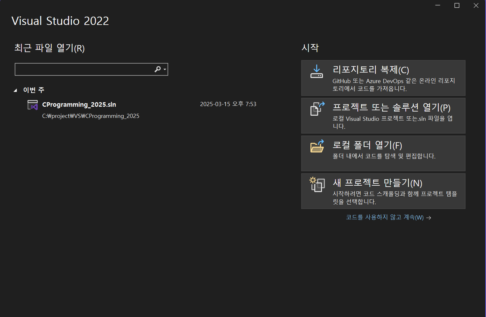
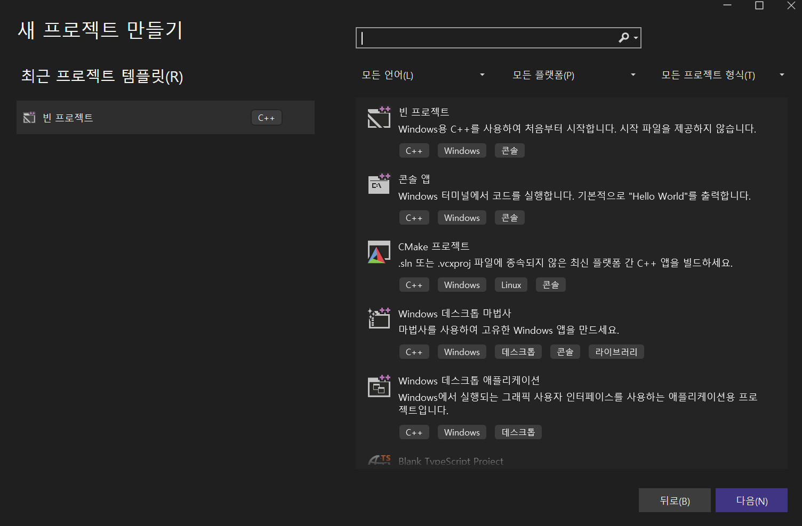
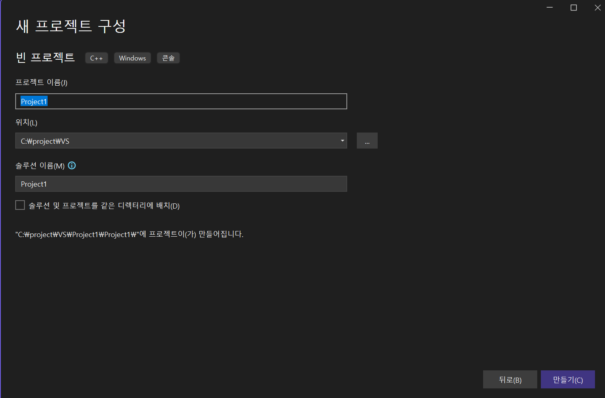
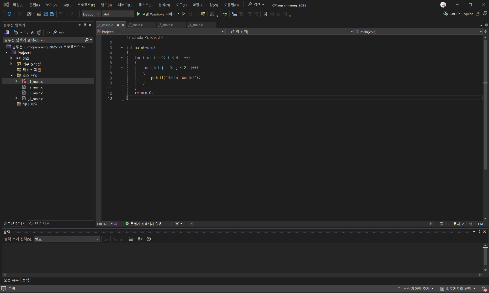
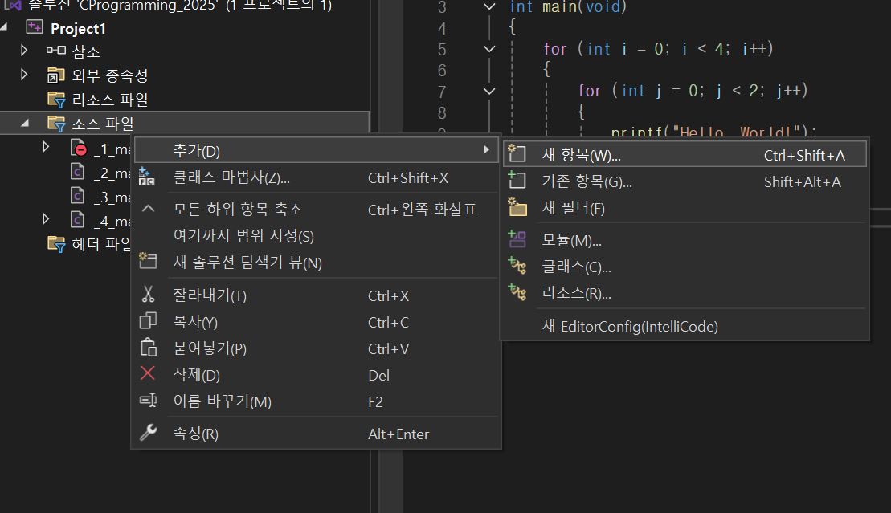
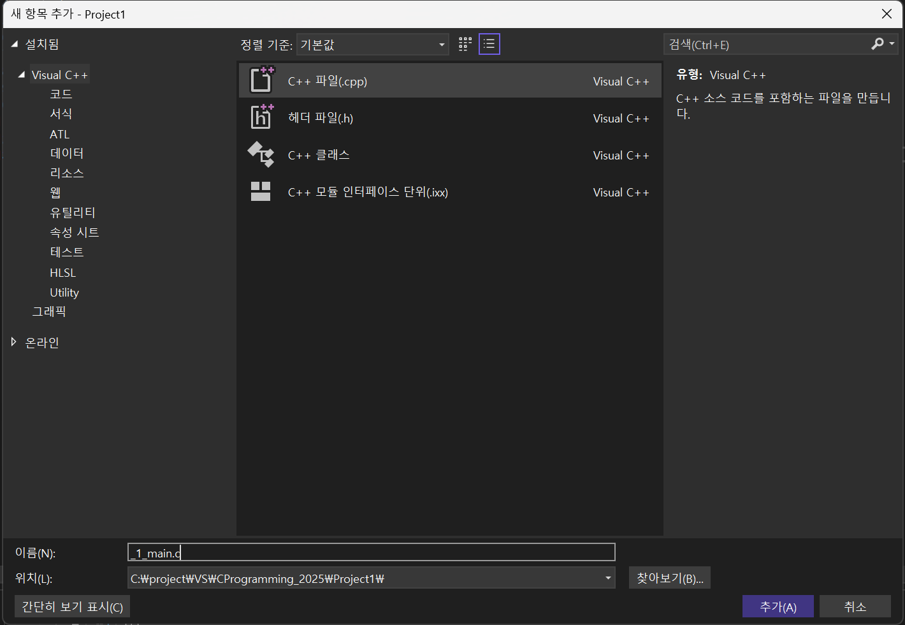
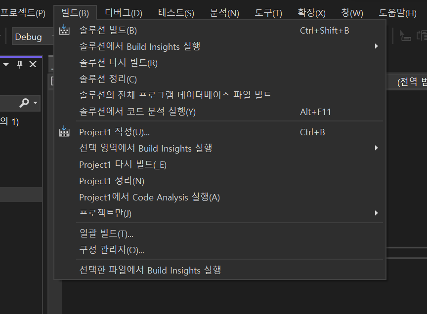
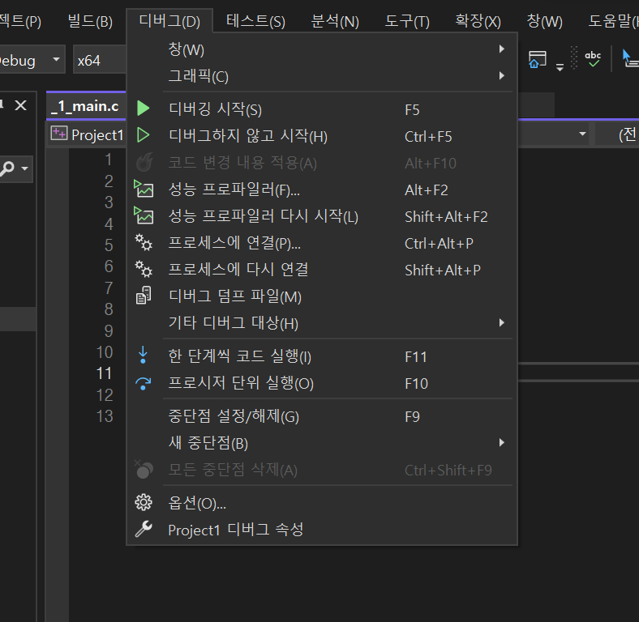

## Intro

이 블로그 포스트에서는 **Visual Studio**를 이용한 프로젝트 작성, 에디터 활용, 컴파일, 실행 및 디버깅 방법에 대해 알아보고
**C언어의 기본 요소**(코멘트, main 함수, 전처리기, 헤더파일, 변수, 그리고 printf와 scanf 사용법법)를 알아봅니다.

## Visual Studio 사용법

### 프로젝트 작성

Visual Studio는 강력한 통합 개발 환경(IDE)으로, 프로젝트 생성을 위한 다양한 템플릿을 제공합니다 !



프로젝트 생성은 시작 화면에서 "**새 프로젝트 만들기**"를 선택하여 진행합니다.



여기서 "Window용 C++을 사용하여 처음부터 시작합니다." 빈 프로젝트를 클릭합니다.



프로젝트 이름과 솔루션 이름은 **똑같이 설정**하고 밑에 있는 "솔루션 및 프로젝트를 같은 디렉터리에 배치(D)"를 체크합니다.

### 에디터 설명



- 왼쪽 옆 모서리에 있는 **솔루션 탐색기**는 솔루션의 폴더 경로를 보여줍니다.
- 솔루션 탐색기 옆에 있는 넓은 공간은 파일의 내용을 보여줍니다. 여기에 코딩을 적습니다.
- 밑에 있는 **출력**에서는 빌드할때 로그를 볼수 있습니다.

### c파일 생성



1. 솔루션 탐색기의 소스 파일에 마우스 우클릭을 한다.
2. 추가를 누르고 새 항목을 누른다.



C++ 파일을 선택하고 **이름의 확장명은 .c**로 바꿔주세요 !

### 컴파일



1. 맨 위에 있는 메뉴에서 빌드를 선택
2. 솔루션 빌드를 선택해 컴파일합니다.
   (단축키인 "Ctrl + Shift + B"를 눌러도 됩니다.)

3. 컴파일을 하면 밑에 출력에서 컴파일 결과를 알려줍니다.
4. 컴파일에 실패하면 에러 메시지를 표시합니다.

### 디버깅 및 실행

디버깅 도구는 개발 중 발생할 수 있는 오류를 빠르게 찾아내고 수정할 수 있도록 도와줍니다.



맨 위에 있는 메뉴에서 디버그를 선택합니다.

1. 디버깅 시작 : 설정된 브레이크포인트에서 **일시 정지되어 코드의 흐름을 분석**할 수 있습니다.
2. 디버그하지 않고 시작 : 디버그를 진행하지 않고 **바로 실행**해줍니다.

## C언어 기본 요소

### 코멘트 (주석, Comment)

코멘트는 **코드 내에 설명**을 덧붙일때 이용합니다.

- 단일줄 코멘트 : `//`
- 여러줄 코멘트 : `/* */`

```c showLineNumbers
int a = 4; // a는 4입니다.

/* 이건
   여러줄
   코멘트 */
```

### main 함수

main 함수는 **프로그램의 시작을 담당**합니다.
모든 C 프로그램은 실행의 시작점인 main() 함수를 포함해야 합니다.

```c showLineNumbers
int main() {

}
```

### 전처리기 (Preprocessor)

전처리기는 컴파일 전에 코드에 특정 작업(헤더 파일 포함, 매크로 정의 등)을 수행합니다.
대표적인 전처리기 지시문으로 `#inculde`와 `#define` 등이 있습니다.

### 헤더파일 (Header file)

헤더 파일은 C 언어에서 사용하는 일종의 레퍼런스입니다.
주로 외부 소스 파일에 정의된 변수나 함수를 쓰기 위해 만들어졌습니다.

예를 들어 `stdio.h` 헤더는 Standard Input and Output Library 의 약자로, **입/출력을 실행하기 위한 헤더파일** 입니다.
이 헤더에는 `printf`나 `scanf` 같은 함수가 있습니다.

```c
#include <stdio.h>
```

### 변수 (Variables)

변수는 **데이터를 저장하는 공간**으로, C언어에서는 사용 전에 반드시 타입을 선언해야 합니다.
정수형 변수는 `int`, 실수형 변수는 `float` 또는 `double`형을 사용하며, 변수는 선언과 동시에 초기화할 수 있습니다.

```c showLineNumbers
/*
    변수명 규칙
    1. 변수명은 오직 영어, 숫자, _로만 구성되어 있어야 한다.
    2. 숫자가 가장 앞에 위치하면 안된다.
    3. 띄어쓰기(공백)이 있으면 안된다.
    4. 예약어는 변수명으로 사용할 수 없다.
    5. 대소문자를 구분한다.
*/
    int a = 2;
    float b = 2.2f;
    double c = 2.2;

    // 이렇게 같은 자료형이면 여러개 적어도 가능 !
    int a = 2, b = 3;
```

### printf 와 scanf 함수

- printf() : 텍스트나 변수의 값을 **출력**하는데 사용
- scanf() : 사용자로부터 **입력**을 받음

두 함수는 `stdio.h` 헤더파일에 선언되어 있으므로 사용하기 위해서는
코드 상단에 `#inculde <stdio.h>` 적어야합니다.

```c showLineNumbers
#define _CRT_SECURE_NO_WARNINGS
#inculde <stdio.h>

int main(void) {

    // 사용자에게 "Hello"라고 출력
    printf("Hello");

    // printf에서 변수가 int인 값을 출력할때는
    int a = 3;
    printf("%d", a);

    // printf에서 변수가 float인 값을 출력할때는
    float b = 3.14f;
    printf("%f", b);

    //================================================

    // scanf에서 int 값을 입력 받을때는
    int c;
    scanf("%d", &c);

    // scanf에서 float 값을 입력 받을때는
    float d;
    scanf("%f", &d);


    //================================================
    // 사용자에게 숫자를 받고 출력하는 소스

    int number;
    printf("숫자를 입력하세요: ");
    scanf("%d", &number);
    printf("입력한 숫자: %d\n", number);
}
```

Visual Studio와 같은 개발 환경에서는 scanf 함수가 입력 데이터를 받을 때 버퍼 오버플로우와 같은 보안 취약점이 발생할 위험이 있기 때문에,
보안을 강화한 `scanf_s` 사용을 권장하거나,

경고 메시지를 무시하기 위해 코드 상단에 `#define _CRT_SECURE_NO_WARNINGS`를 추가하는 방법을 사용합니다.
이 매크로는 컴파일러에게 이전의 **안전하지 않은 함수 사용에 대한 경고를 출력하지 말라는 지시 역할**을 합니다.
