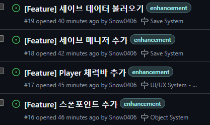

## 2024.10.21 개발일지

#### 대시 수정 및 애니메이션 매니저 추가

- 대시를 양 옆만 가능하게 수정
- Animation 매니저 추가: 플레이어와 적의 애니메이션을 관리하는 매니저 시스템

---

## 2024.10.22 개발 일지

#### PlayerAnimation 개발

- Animation 매니저를 이용한 플레이어 애니메이션 관리하는 `PlayerAnimation` 개발

---

## 2024.10.23 개발 일지

#### Input 시스템, 씬 전환 애니메이션 추가

- Input 시스템 넣기: 키보드 말고 패드나 다른걸로도 할 수 있게 지원
- 씬 전환 애니메이션 추가: 스테이지 넘어갈때 자연스러운 스테이지 전환

---

## 2024.10.24 개발 일지

#### 사운드 관련 기능 추가

- 사운드 컨트롤러 추가
- 대화창에 텍스트 입력될때 사운드 나오게 추가

> 오늘은 일단 어제 넣은 씬 전환 애니메이션이 오류가 이쁘게 터져서 고치고
> 스토리 컷씬 컨트롤러를 만들거에요. 아마도?
> 갑자기 사운드에 꽂혀서 스토리 컷씬 컨트롤러 안 만들고 사운드 컨트롤러 추가했어요 !

---

## 2024.10.25 개발 일지

#### ObjectManager 추가

- ObjectManager 추가: 각종 상호작용 되는 오브젝트를 전반적인것을 관리해주는 매니저

> 저번에 만들어논 대화 매니저를 이용하여 테스트용 대화 데이터를 넣어서 테스트 해보고 체력바 UI를 넣어볼 예정
>
> ㅎㅎ.. 졸려서 내일 하는걸로

---

## 2024.10.26 개발 일지

#### 대화 데이터 불러오기, 폰트 추가

- 대화 데이터(한국어, 영어, 일본어) 지원
- 스토리 대화 불러오기 기능 추가
- 일본어 지원을 위해 일본어 폰트 추가

#### ObjectManager 애니메이션 추가, 디코 서버 프로필 추가

- ObjectManager 애니메이션 업데이트 지원
- 디스코드 서버 프로필 추가

> 대화 매니저를 테스트 해봤는데
> 단짝친구 오류를 만나서 고쳤고,
> 일본어의 글자가 꺠져서 일본어 폰트를 넣었음. ObjectManager에 Animator을 추가하여
> 각종 오브젝트의 애니메이션을 넣을수 있게 수정함

---

## 2024.10.27 개발 일지

#### Assembly Definition 추가

> Github에 무슨 기능 만들어야 되는지 TODO 44개 만듦

---

## 2024.10.28 개발 일지

#### 폰트 수정 및 추가

- 영어 폰트 수정
- 일본어에 들어갈 한자 폰트 추가

#### 스폰포인트 개발 시?작

> 저번에 일본어 넣은것 중에 한자가 없어서 한자 꺠지는 오류 수정하고 스폰포인트 제작중 (월요병이라 개발 많이 안한듯)

---

## 2024.10.29 개발 일지

#### 스폰포인트 추가

#### 각종 매니저 추가

- Interaction Manager 추가
- BaseManager 추가

> 오늘은 일단 스폰포인트 완성하고 코드 정리하는게 목표 ! 시간 남으면 체력바 UI 까지

---

## 2024.10.30 개발 일지

#### 세이브 매니저 추가

- SaveData 추가: AM 5:24
- SaveManager 추가: AM 2:00
- Save 데이터 불러오기 성공: AM 3:14

> 🎃 할로윈 D-1
>
> 세이브 매니저를 추가 했는데 테스트를 안해봐서 어떤 오류가 나올지 와쿠와쿠 ㅠ

---

## 2024.10.31 개발 일지

#### Chap1 적 컨트롤러 추가

#### 매니저 및 UniTassk -> UniTaskVoid 수정

- 1장 적 컨트롤러 추가
- 세이브 매니저 오류 수정
- 일부 UniTask -> UniTaskVoid 수정

> 👻 할로윈 D-Day !!
>
> 오늘은 1장에 나오는 적을 만들 예정!
> 오늘은 1장에 나오는 적의 컨트롤러를 추가하였고 약간의 오류를 수정하였다.
