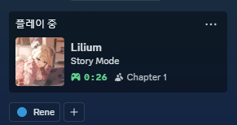

## 2024.11.1 개발 일지

#### Chap1 적 컨트롤러 업데이트트

- 1장 적 컨트롤러 테스트
- 1장 적 플레이어 탐지 오류 해결
- 적 stats 관리 방식 업데이트

> 오늘은 약간 쉬어가는 느낌으로
> 개발을 많이 안 한것 같다 ㅌㅌ

---

## 2024.11.2 개발 일지

#### DiscordManager 추가

> 디스코드 Rich Presence 추가할때 오류에 막혀서 새로운 패키지로 완성 !
>
> 사진은 [테스트용 사진](https://twitter.com/RUDA_E/status/1851131394644459994) 입니다 !

---

## 2024.11.3 개발 일지

#### 스토리 컷씬 개발 시작

- 시네마틱 바 추가
- DialogData에 Event 추가
- DialogEventManager 개발중

> 오늘부터 프롤로그 스토리 컷씬 개발 시작 !

---

## 2024.11.4 개발 일지

#### AnimationEventHandler 추가

- DialogEventManager 절반 완성
- AnimationEventHandler 추가

> 오늘은 월요일이라 월요?병때문에 개발을 많이 안 했네요.. 머쓱..

---

## 2024.11.5 개발 일지

#### 카메라 컨트롤러 업데이트트

- CameraController 업데이트
- GameObjectManager 추가

#### 스토리컷씬용 EventManager 추가가

- CameraEventHandler 추가
- DialogEventManager 완성

---

## 2024.11.6 개발 일지

#### PlayerCombat 추가

- PlayerCombat 추가
- 칼 공격 추가
- 칼 패링 추가

> 오늘부터 1시에 자기 !!

---

## 2024.11.7 개발 일지

- ShootingEnemy 개발중
- 투사체 관련 매니저 개발중

> 오늘은 대충 틀만 잡았고 내일 완성하는걸로 !

---

## 2024.11.8 개발 일지

#### 투사체, 총 매니저 추가가

- 총 관련 매니저 추가
- 투사체 관련 매니저 추가

> 오늘은 개발을 많이 안 했다.. 머쓱

---

## 2024.11.9 개발 일지

#### BaseEnemyController, 총 쏘는 적 추가

- 총 쏘는 적 완성
- 베이스 적 컨트롤러 완성

---

## 2024.11.10 개발 일지

#### 패링 구현, 투사체 매니저 업데이트트

- 총 쏘는 적 패링 당했을때 구현
- 투사체 매니저 업데이트

> 내일부터 개발은 멈추고 이제 스토리 작성을 하겠습니다 !

---

## 2024.11.16 개발일지

#### BaseEnemyController 오류 수정

---

## 2024.11.20 개발일지

#### Rene Idle Animation 수정

> 대학 면접 D-3

---

## 2024.11.25 개발일지

#### 달리기 애니메이션 제작중

---

## 2024.11.29 개발일지

#### Chap1 바닥 타일, 스폰포인트 오브젝트 추가

- Chap1-01, Chap1-02 바닥타일 추가
- 스폰포인트 오브젝트 개발
