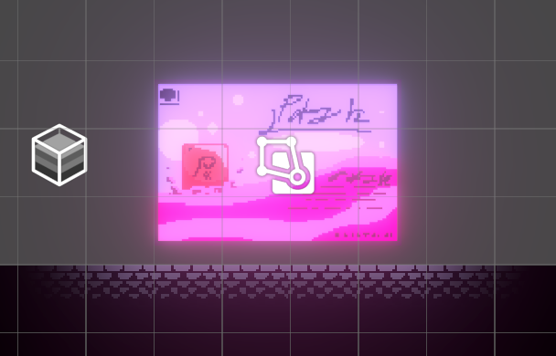
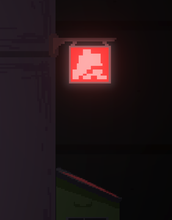
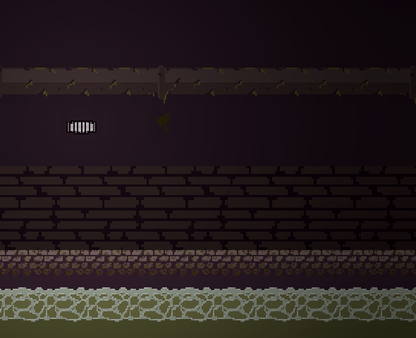
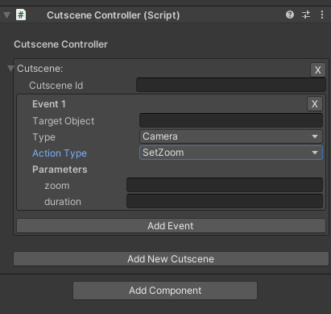
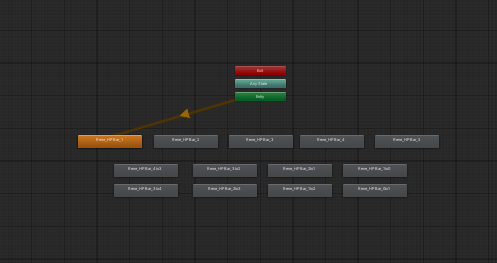

## 2024.12.1 개발일지

#### 달리기 애니메이션 추가

---

## 2024.12.2 개발일지

#### 달리기 애니메이션 수정

- 달리기 시작부분 애니메이션 추가
- 달리기 애니메이션 수정

---

## 2024.12.3 개발일지

#### 달리기 사운드 추가

- 애니메이션 매니저 수정
- 사운드 매니저 수정
- 사운드 이벤트 핸들러 추가
- 달리기 사운드 추가

> 달리기에 사운드를 넣었는데 ㅁ..뭔가 하이힐 신고 달리는 느낌이라서 베타때 의견 들어봐야할듯

---

## 2024.12.4 개발일지

- 소스 리팩토링
- 주인공 애니메이터 점프 관련 로직 추가

> 오늘은 약간 쉬어가는 날이네요

---

## 2024.12.5 개발일지

#### 스폰포인트 애니메이션 추가

---

## 2024.12.6 개발일지

#### 스폰포인트, 상호작용 매니저 추가, 세이브 매니저 수정

- 스폰포인트 매니저 추가
- 상호작용 매니저 수정
- 세이브 매니저 수정

> 열심히 웹소설을 보다가 아 맞다 코딩!
>
> 새벽 4시부터 스타트 하였지만 졸려서 내?일 마저 완성하는걸로

---

## 2024.12.7 개발일지

#### 스폰포인트, 세이브 매니저 수정

> 어제 마무리 못한거 마무리 하고 오류까지 수정했습니다 !

---

## 2024.12.9 개발일지

> Chap1-01, Chap1-02 맵에 나오는 오브젝트를 그렸습니다.
>
> 따라서 내일부터 레벨 디자인을 해보겠습니다.

---

## 2024.12.10 개발일지

#### 스폰포인트 빞, 파티클 추가

- 간판 빛 추가
- 스폰포인트 파티클 추가
- 스폰포인트 빛 애니메이션 추가

> Light에 대해 연구하고 있습니다. 특히 발광을 어떻게 처리할지 고민중...

---

## 2024.12.11 개발일지

#### Chap1-01 맵 추가

- Chap1-01 맵 추가
- 그림자 추가

> Chap1-01 맵은 다 만들었습니다 !
> 오늘은 오브젝트 애니메이션을 넣어보겠습니다.

---

## 2024.12.12 개발일지

#### Chap1-01 맵의 전등 깜빡임 추가

- Chap1-01 맵의 전등 깜빡임 추가
- 메인화면 UI 오브젝트 추가
- Pixel Light Shader 연구중

> 전광판의 빛으로 인해 주위 오브젝트 테두리의 약간 색이 입히는
> 그런 쉐이더를 연구중입니다.. 어떻게 하지 그냥 노가다 할까(?)

---

## 2024.12.13 개발일지

#### 챕터 관련 매니저 개발 시작

- Chap1-01 오브젝트 스크립트 추가
- ChapterManager 개발중
- SceneTransition 개발중

> Chap1-01에서 Chap1-02로 넘어가게 해주는
> 오브젝트의 스크립트를 제작하다가
>
> Dirty Flag 패턴을 이용하여 플레이어 주변에만 지역을 로딩한다는걸 영감 받고 저희 게임에도
> 다음 챕터로 넘어갈때 이전 챕터는 비활성화, 다음 챕터는 활성화 방식을 추가하기 위해 코딩을 하고 있습니다.
>
> 그리고 챕터 넘어갈때 자연스럽게 전환하기 위해
> 화면 FadeIn, FadeOut을 제작하고 있습니다.

---

## 2024.12.14 개발일지

#### ChapterManager 추가 (Dirty Flag 패턴 사용용)

- Chap1-01 오브젝트 애니메이터 추가
- ChapterManager 완성
- 폴더 구조 리팩토링 진행

> 프로젝트의 폴더 구조를 바꾸면서 스크립트 리팩토링을 진행했습니다. 그리고 Dirty Flag 패턴인 ChapterManager을 만들었습니다.
> 그리고 각종 오브젝트의 애니메이터를 만들었습니다.

---

## 2024.12.15 개발일지

#### 컷씬 관련 추가

- Chap1-02 Asset 추가
- Rene Jump Animation 추가
- ChapterController 추가
- GameEntityManager 추가
- CutsceneEvent 추가

> 헉 벌써 새벽 5시... 새벽에 보내는 개발일지네요
>
> 오늘은 Chap1-02 에셋을 저장하고 챕터를 전환할때 플레이어를 이동시키는 스크립트와 스토리 컷씬 매니저를 만들기 위한 스토리 컷씬 데이터 스크립트를 만들었습니다.
>
> 그리고 아트에서는 주인공 점프 애니메이션을 만들었습니다
>
> 내일은 스토리 컷씬 매니저를 마무리하겠습니다.

---

## 2024.12.16 개발일지

#### 컷씬 매니저와 에디터 추가

- CutsceneManager 추가
- CutsceneController 추가
- CutsceneManagerEditor 추가
- EventManager 추가
- Chap1-02 Map 90% 추가

> 오늘은 컷씬 매니저와
> 편하게 컷씬을 만들 수 있게 에디터를 만들었습니다.
>
> Chap1-02 Asset을 이용해서 Chap1-02 맵을 90%정도
> 만들었습니다.
>
> 컷씬 매니저 테스트는 안해서 잘 작동하는지 몰?루

---

## 2024.12.17 개발일지

#### 컷씬 매니저를 관리하는 에디터 업데이트

- Cutscene Trigger 추가
- CutsceneEditor 업뎃
- Rene 점프 force 수정
- 벽, 바닥 탐지 통합

> 오늘은 컷씬 매니저를 관리하는 에디터를 업데이트 하였습니다.
>
> 그리고 컷씬 매니저를 약간 관리하기 편하게 좀 분리하였습니다.

---

## 2024.12.18 개발일지

#### Emission 쉐이더 추가

- Glow 쉐이더 추가
- Cutscene 에디터 수정
- GameEntityManager 수정

> 첫 쉐이더 그래프를 이용해 특정부분 발광 효과 주는걸 만들었습니다.
>
> 오늘은 약간 쉬어가는 타임이네요.

---

## 2024.12.19 개발일지

#### SceneEntityRegistrar 추가

- 벽 등반 추가
- 벽 점프 취소 추가
- SceneEntityRegistrar 추가
- GameEntityManager 수정

> 오늘 컷씬 매니저를 이용해 간단하게 카메라 무빙 테스트를 해봤습니다. 그리고 벽 등반을 추가하였습니다.
>
> 아트는 Chap1-04에 나오는 적 대기 모션을 만들었습니다.

---

## 2024.12.21 개발일지

#### 메인메뉴 UI 배치

- 메인메뉴 UI 수정
- 메인메뉴 스크립트 수정
- SaveData 수정
- SceneLoader 수정

> 오?늘은 메인메뉴 씬 UI 배치와 스크립트 작업을 하였습니다
>
> 아트는 Chap1-04에 나오는 적 걷기 모션을 만들었습니다.

---

## 2024.12.22 개발일지

#### 메인메뉴 UI, SaveManager 중복 수정

- 메인메뉴 UI 수정
- 메인메뉴 버튼 커지는 기능 추가
- SaveManager 중복 수정
- Rene 점프 애니메이션 추가

> 오늘은 메인메뉴 씬 UI 어제 못하던거 끝내고
> 점프 애니메이션을 넣었는데... 큼 오류가 많군요
> 내일 수정하는걸

---

## 2024.12.23 개발일지

#### 체력바 UI 추가

- 점프 애니메이션 수정
- 체력바 UI 추가

> 오늘은 점프 애니메이션을 자연스럽게 바꿨고
> 플레이어 HP 바를 넣었습니다.
> HP바는 테스트 안함 ㅎㅎ..

---

## 2024.12.25 개발일지

#### HP 바 애니메이션 추가

> HP바 회복 애니메이션 얻으면 테스트 해보는걸로
>
> 메리 크리스마스 메리 솔크

---

## 2024.12.26 개발일지

#### Chap1 적 스크립트 추가

- Chap1 적 Sprite 추가
- Chap1 적 스크립트 추가

> 내일 새벽에 일본으로 출발해야되서 코딩을 별로.. 못했습니다.. 일본 여행 가고 나서 1월 5일부터 빡세게 달리겠습니다.
