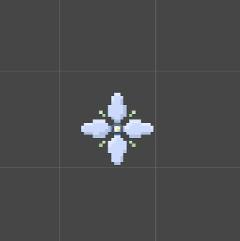

## 2025.1.4 개발일지

#### Chap1 적 완성

---

## 2025.1.6 개발일지

#### HPBar 코드 추가

- HPBar 코드 추가
- HPBar 오류 추가(?)
- Chap1 오류 추가(?)

> 저번에 만든 체력바 애니메이션을 얻어서
> 체력바를 관리하는 코드를 만들었습니다.
>
> 이제 그 코드를 테스트 할려고 어?제 만든 Chap1 적으로 할려고 했는데
> 오잉 Chap1 적 공격에 오류가!!
> 라고 말하는 순간 체력바도 오류가 있더라고요 ㅎㅎ
>
> 네.... 자기 전까지 고쳐보겠습니다

---

## 2025.1.7 개발일지

#### 오류 수정

- HPBar 오류 수정
- Chap1 작 오류 수정

> 체력바 오류 수정 다 했고
> Chap1 적 공격 오류 수정도 다 했습니다 !
>
> 근데 충격적인 소식이 있어요...
> 오전 5시쯤에 잠 들었는데 오후 7시에 일어났어요 !!!!!!!!

---

## 2025.1.8 개발일지

> 오늘은 소스 작업은 안하고 컷씬 어떻게 구상할지 생각하면서 놀았습니다.
>
> 죄송합니다..
> 오늘 자고 일어나서 컷씬 마무리 하겠습니다

- 명조 게임 이벤트 밀기
- 카를로타 에코작 하기
- 중앙탑 밀기
- 깃허브 레포 라벨 정리

---

## 2025.1.9 개발일지

#### 컷씬 함수 이벤트 매니저 추가

- 컷씬함수이벤트매니저추가
- 컷씬애니메이션이벤트매니저 수정
- GameEntityManager 수정

---

## 2025.01.10 개발일지

#### 벽점프, 벽슬라이딩 애니메이션 추가

- Fade 추가
- 스토리 컷씬 완성
- 벽점프, 벽슬라이딩 애니메이션 추가

> ㅋㅋㅋㅋㅋㅋㅋㅋㅋㅋㅋㅋㅋ
> 르네의 개인기입니다

> 거..미...줄

---

## 2025.01.13 개발일지

#### 애니메이션 이벤트 핸들러 리팩토링

- 컷씬 애니메이션 작동 Play로 수정
- 애니메이션 이벤트 핸들러 리팩토링

> 다른 프젝 2개 끝내니.. 새벽 2시...
> 르네 프젝 할려고 했는데.. 머리가 안 돌아가네요.
>
> 내일은 꼭 르네 우선으로 하겠습니다
> 안하면 딸기라떼 쏠게요 !!

---

## 2025.01.14 개발일지

#### 벽점프 업데이트, 벽슬라이딩 오류 수정정

- CheckWall RayCast 1개 더 추가
- 벽점프하고 반대방향갈때 감속 추가
- 벽슬라이딩 애니메이션 오류 수정

#### Chap1-01, Chap1-02 맵 수정

- Chap1-02 벽점프할수 있는 파이프 수정
- Chap1-01, Chap1-02 맵 양 끝쪽 투명벽 추가
- Core 폴더 리팩토링 시작 (오늘안에는 끝나겠지)

> 일단 알파 테스터 유저를 다 구했습니다 !
> 그리고 아트 퀄리티를 높이기 위해 아트분 1명을 더 납치했습니다.
>
> 오늘은 이 프젝밖에 안해서 생각보다 많이 작업했어요 !

---

## 2025.01.15 개발일지

#### Core 폴더 리팩토링

- Core 폴더 리팩토링 어제 오전 7시에 클리어
- 카메라 이동 구역 추가
- 적 스탯 리팩토링

> 오늘은... 어제 많이 했으니 쉬면서 했습니다..
> 여러분들은 밤낮 바뀌지 마시고 건강 잘 챙기십쇼
>
> 전 이만 자러 가보겠습니다.
> 모두 잘자요 굿나잇

---

## 2025.01.16 개발일지

#### Chap1 튜토 표지판 및 화살표 추가

- 컷씬 애니메이션 오류 수정
- Chap1 튜토 표지판 및 화살표 추가
- 스토리 작성 스타트

> 어.. 오늘도 쉬면서 했습ㄴ니다.
> 저 화살표에 발광을 넣을까요? 말까요?
> 근데 저는 간지나서 넣을거에요 ㅎㅎ

---

## 2025.01.17 개발일지

#### 잡다한거 추가

- Chap1-02 맵 확장 (알파때 적용X)
- 모드선택창의 NewGame 이미지 추가
- 상호작용하라는 표시 추가
- Chap1-01 맵 오류 수정
- Chap1-01 카메라 이동 구역 오류 수정
- Window 빌드 세팅

> 졸려요 잘래요

---

## 2025.01.18 개발일지

#### 알파테스트 #1 진행 !

> 오늘 첫 알파테스트를 진행했는데
> 버그가 많네요... 세스코 불러주세요
> 저 버그 못 잡아요 으아아아악ㄱ

---

## 2025.01.19 개발일지

#### 알파테스트 #1 오류 수정

- 2단 점프 버그 수정
- 코요테 점프 기능 삭제 (2단 점프 버그)
- W, S 누르면 이속 감속 버그 수정
- 벽 슬라이딩에서 미끄러진채로 이동하면 마이클잭슨이 되는 버그 수정
- 멈췄을때 몸이 반대 바라보는 버그 수정
- 착지 애니메이션 2번 작동 되는 버그 수정
- 벽이 머리에 부딪쳐서 가만히 있는 버그 수정
- 점프했을떄 벽이랑 발에 부딪쳐서 가만히 있는 버그 수정
- 벽점프할때 몸이 반대로 2번 바라보는 버벅 버그 수정

> 후... 일단 버그를 싹 고쳤습니다..
> 중간에 잘려고 했는데 벌레가 기어다니길래
> 못 참고 끝까지 고쳤습니다

---

## 2025.01.21 개발일지

#### 커스텀 A\* 알고리즘 추가

- Grid2D 추가
- Pathfinding2D 추가

#### 드론 적 컨트롤러 추가

- DroneEnemyStats 추가
- DroneEnemyController 추가

> 커스텀 A\* 알고리즘을 만들고 그걸 이용하여 드론 Enemy 컨트롤러도 만들었습니다 !
>
> 그 커스텀 A\* 알고리즘을 구현할때 저가 바보라서 알고리즘 이해가 너무 오래걸려서 나중에 까먹을까봐 깔끔하게 정리도 했습니다.
>
> 자고 일어나서 저녁쯤에
> 드론 테스트 하고 오류 고치고 끝낼것 같습니다 !
>
> 오늘부터 일찍 자겠습니다. 다들 좋은꿈 꾸세요

---

## 2025.01.22 개발일지

#### 커스텀 A\* 알고리즘 오류 발생생

> 어제 짰던 코드를 테스트 했는데.. 네 작동을 안했습니다. 그래서 갈아엎고 다시 짜는데 성공했습니다.
>
> 근데 컴퓨터가 약간 아파해서 최적화를 진행하고 켰는데 터졌습니다.
>
> 내일 다시 시도하겠습니다.

> 저렇게 적이랑 떨어지는 순간 게임 종료 ㅋㅋㅋㅋㅋㅋㅋㅋㅋㅋㅋ

---

## 2025.01.23 개발일지

#### 커스텀 A\* 알고리즘 업데이트, 하지만 어림없지 오류 발생

- Grid2D 업데이트
- Pathfinding2D 업데이트
- DroneEnemyStats 업데이트
- DroneEnemyController 업데이트

> 오늘은 이제 드론 Enemy 컨트롤러에 최?적화 한 알고리즘을 넣었고
> 갑자기 또 에디터가 죽엇습니다.
> 네 새벽까지 고치겠습니다

---

## 2025.01.25 개발일지

#### Chap1-02 맵 일부분 추가

- PlayerAnimation 오류 수정
- Chap1-02 맵 일부분 추가

> 좋은아침이에요
> 오?늘은 컷씬 오류를 고쳤고
> hap1-02 맵 레벨 디자인을 했습니다.

---

## 2025.01.26 개발일지

#### 플레이어 이동시 가속과 감속 추가

- 플레이어 이동시 가속과 감속 추가
- Chap1-02 빛 작업 끝
- Chap1-02 카메라 길 더 추가

> 알파테스터 @SHSNOWFLOWER @삼각원뿔 님이 피드백 해주신 플레이어 가속과 감속을 추가하였습니다 !

> 르네는 사실 발광합니다

---

## 2025.01.30 개발일지

#### 서브 스킬 구현 (98%)

- TimeManager 추가
- ITimeReversible 인터페이스 추가
- AfterImageManager 추가
- TimeReverse 추가

> 서브 스킬을 98% 정도 구현했습니다.
> 내일은 리팩토링부터 하고 이펙트랑 사운드를 추가해보겟습니다
>
> 새해복 많이 받으세요 !!
>
> 서브 스킬 사운드가 너무 웅장해서... 다른 스킬 사운드는... 스읍..
