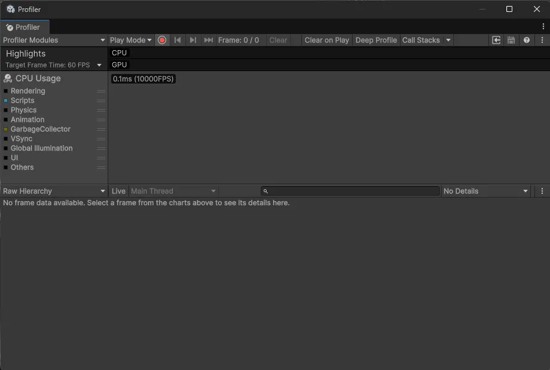
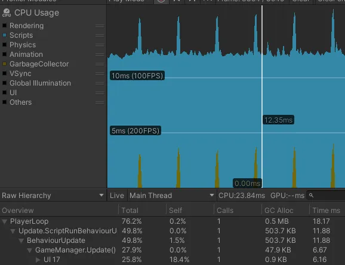

import Callout from '@/components/Callout.astro'

## Introduction
최근 프로젝트에서 최적화 작업을 담당하게 되었습니다. 
최적화가 처음이라 어디서부터 시작해야할지 아예 감이 안잡혔습니다...

이 글은 제가 직접 박치기하면서 배운 유니티 최적화 방법들을 정리한 글입니다.
제가 직접 박치기 하면서 "이 코드가 왜 CPU 사용량을 많이 잡아먹는지", "왜 GC.Alloc을 유발하는지"
원인을 분석해보고, 해결책을 찾아가면서 느꼈던 점들을 중심으로 작성했습니다.

<Callout variant="note">
    - Unity 6000.0.59f2 기준으로 작성되었으며, 다른 버전도 비슷할겁니다. 아마도?
    - 현재 다른 작업으로 인해 글이 완성되지 않았습니다. 지속적으로 업데이트할 예정입니다.
</Callout>

## Unity Profiler

일단 성능 최적화하기 전에 **어디에서 성능 병목이 발생**하는지 측정하고 분석하는 과정이 필요합니다.
유니티 에디터에서는 자체적으로 제공하는 [Unity Profiler](https://docs.unity3d.com/Manual/Profiler.html)를 통해
CPU, GPU, Memory 사용량을 측정하고 분석할 수 있습니다.

#### How to Use Unity Profiler

일단 유니티 에디터 상단 메뉴에서 `Window > Analysis > Profiler`를 클릭하여 프로파일러 창을 엽니다.


저는 일단 CPU 최적화를 중심적으로 살펴보기 위해 CPU Usage의 `Scripts`, `Garbage Collector` 카테고리만 켜두고 나머지는 껐습니다.

<Callout variant="note">
- `측정 시작/중지`: 프로파일러 창 상단에 **빨간 버튼**을 눌러 시작/중지
- `Clear`: 프로파일러 분석한 데이터들을 초기화
- `Deep Profile`: 스크립트 내부 함수 호출까지 분석 (렉이 많이 발생하므로 주의) (비추천)
- `공식 문서`: [Unity Profiler Window](https://docs.unity3d.com/Manual/ProfilerWindow.html) 참고
</Callout>

<Callout variant="tip">
`Others` 카테고리는 에디터에서만 발생하는 오버헤드이므로 무시해도 됩니다.
</Callout>

#### Custom Profiler Markers

유니티 프로파일러는 기본적으로 유니티 엔진의 콜백 함수들 (`Start`, `Update`, `FixedUpdate` 등) 만 분석해주기 때문에
어떤 함수가 문제인지 찾기 어렵습니다. 이럴때는 [ProfilerMarker](https://docs.unity3d.com/ScriptReference/Unity.Profiling.ProfilerMarker.html)
을 사용하여 그 부분만 자세하게 분석할 수 있습니다.

```csharp title="TestProfilerMarker.cs"
using Unity.Profiling;
public sealed class TestProfilerMarker
{
    private void Update() 
    {
        MyMethod1();
        MyMethod2();
    }

    private static readonly ProfilerMarker myMarker1 = new ProfilerMarker("MyCustomMarker1");
    private static readonly ProfilerMarker myMarker2 = new ProfilerMarker("MyCustomMarker2");
    
    // 첫번째 방법
    private void MyMethod1()
    {
        myMarker1.Begin();
        // 측정하고 싶은 코드
        myMarker1.End();
    }

    // 두번째 방법
    private void MyMethod2()
    {
        using (myMarker2.Auto())
        {
            // 측정하고 싶은 코드
        }
    }
}
```
<div style="text-align: center;">

최적화 전 GameManager.cs에 넣은 `UI 17` 마커
</div>

<Callout variant="explanation">
 Q. 그냥 `Deep Profile` 켜면 안되나요? <br/>
 A. `Deep Profile`은 모든 함수 호출을 추적하기 때문에 렉이 심하게 발생하기 때문에 `ProfilerMarker`를 사용하여 필요한 함수만 선택적으로 분석하는 것이 좋습니다.
</Callout>

<Callout variant="explanation">
 Q. `UI 17` 마커는 뭐길래 CPU를 많이 사용해요? <br/>
 A. 업데이트마다 계속 Canvas Alpha를 변경하고 있어서 그렇습니다. 이를 최적화하려면 **값이 실제로 변경될 때만 업데이트**하는 패턴을 사용하세요.
</Callout>

## CPU Optimization

이제 `Unity Profiler`를 사용하여 어디가 문제인지 확인했으니 본격적으로 CPU 최적화를 해보겠습니다.
CPU 최적화를 하면 프레임이 잘 나와서 **게임이 부드럽게 돌아가지만 메모리 사용량은 늘어납니다.**
하지만 대부분 PC는 메모리는 충분히 크기 때문에 CPU 최적화를 우선적으로 하는 것이 좋습니다.

#### Dirty Flag Pattern

처음에 이걸 보고 "?? 더러운 플래그 패턴??" 라고 생각했는데, 이 패턴은 **변경할떄만 업데이트**하는 디자인 패턴입니다.
저희는 개발자니 코드로 보여드리겠습니다.

```csharp title="DirtyFlagExample.cs" ins={14-19} del={11-12} ins="added" del="deleted"
using UnityEngine;
public class DirtyFlagExample : MonoBehaviour
{
    [SerializeField] private Text curLeftBulletText;

    public int curLeftBullet = 10;
    private int _prevBullet = -1;

    private void Update()
    {
        // 이 코드는 매 프레임마다 Text를 변경합니다.
        curLeftBulletText.text = curLeftBullet;

        // 이 코드는 변경 할때만 Text를 변경합니다.
        if (_prevBullet != curLeftBullet)  // 이전 값과 현재 값 비교
        {
            _prevBullet = curLeftBullet;
            curLeftBulletText.text = curLeftBullet.ToString();
        }
    }
}
```

코드로 보면 더티 플래그 패턴은 **이전 값을 캐시하고 현재 값과 비교하여 변경되었을 때만 업데이트하는 방식**입니다.
이를 통해 불필요한 업데이트를 줄여 CPU 사용량을 크게 줄일 수 있습니다.

<Callout variant="tip">
    위 예시는 패턴 이해를 위해 Update에서 비교했지만, 실제로는 값이 변경되는 `시점(Setter)`에서 바로 처리하는 것이 더 효율적입니다.
```csharp title="DirtyFlagExample.cs" ins={8-15} ins="added"
using UnityEngine;
public class DirtyFlagExample : MonoBehaviour
{
    [SerializeField] private Text curLeftBulletText;

    public int curLeftBullet { get; private set; } = 10;
    
    public void SetCurLeftBullet(int newBullet)
    {
        if (curLeftBullet != newBullet) // 변경되었을 때만 업데이트
        {
            curLeftBullet = newBullet;
            curLeftBulletText.text = curLeftBullet.ToString();
        }
    }
}
```
</Callout>

#### Caching

`캐싱 (Caching)`은 데이터 가져오는 비용이 비쌀 경우, 
한 번만 가져와서 변수에 `저장(캐시)` 하고 필요할때마다 캐시해둔 변수를 사용하는 방법입니다.

아까 설명한 `더티 플래그 패턴`은 **불필요한 실행을 줄이는 패턴**이라면
`캐싱`은 **불필요한 탐색을 줄이는 패턴**입니다. (물론 더티 플래그 패턴도 캐싱의 일종이긴 합니다)

##### Component Caching

유니티에서 가장 비용이 많이 드는 작업 중 하나는 `GetComponent`, `FindObjectsByType`, `Camera.main` 처럼
씬에 있는 모든 오브젝트를 `탐색` 하는 작업입니다.

특히 이 함수들을 `Update`, `FixedUpdate` 같은 자주 호출되는 함수에서 사용하면 성능에 큰 영향을 미칩니다.

따라서 이러한 함수들은 `Awake` 또는 `Start`에서 한 번만 호출하여 캐싱하는 것이 좋습니다.
GetComponent를 예시로 설명해보겟습니다.

<Callout variant="danger" title="매 프레임마다 GetComponent 호출">
```csharp title="CachingExample1.cs"
using UnityEngine;
public class CachingExample1 : MonoBehaviour
{
    private void Update()
    {
        GetComponent<Rigidbody>().AddForce(Vector3.up * 10f);
    }
}
```
</Callout>

<Callout variant="solution" title="Awake에서 한 번만 GetComponent 호출하여 캐싱">
```csharp title="CachingExample2.cs"
using UnityEngine;
public class CachingExample2 : MonoBehaviour
{
    private Rigidbody _rb;

    private void Awake()
    {
        _rb = GetComponent<Rigidbody>();
    }

    private void Update()
    {
        _rb.AddForce(Vector3.up * 10f);
    }
}
```
</Callout>

<Callout variant="explanation">
    Q. Camera.main은 왜 캐싱해야 하나요? <br/>
    A. Camera.main은 유니티 엔진 C++의 `FindMainCamera`(C#의 `FindGameObjectsWithTag("MainCamera")`와 유사)를 호출하기 떄문입니다.
</Callout>

##### C++ and C# bridge

유니티는 엔진의 핵심 기능을 담당하는 C++ (Native) 코드와,
우리가 작성하는 C# (Managed) 코드라는 두 개의 다른 환경으로 이루어져 있습니다.

이 두 환경이 소통할때마다 `브릿지`를 건너야 합니다.
`GetComponent`, `transform` 같은 유니티 API를 호출할 때마다 이 브리지 오버헤드가 발생합니다.
따라서 **캐시를 하여 브리지 오버헤드를 줄이는 것이 좋습니다.**

```csharp title="TransformCachingExample.cs"
using UnityEngine;
public class TransformCachingExample : MonoBehaviour
{
    private Transform _cachedTransform;

    private void Awake()
    {
        _cachedTransform = transform;
    }

    private void Update()
    {
        _cachedTransform.position += Vector3.up * Time.deltaTime;
    }
}
```

<Callout variant="note" title='브릿지 건너는 비용이 비싼 이유'>

<Callout variant="explanation" title='Managed/Native 경계 넘기 (Interop Call)'>
Unity API를 호출할때마다 **Managed 영역에서 Unity Engine Native 영역으로 경계를 넘어갑니다**

> [사용자 코드 영역]
>    - Mono: C# (JIT 컴파일)
>    - IL2CPP: C++ (AOT 컴파일됨)
>    - 공통점: 둘 다 `Managed 메모리 모델 사용, GC 존재`
>
>       ↓
>
>       [경계] ← 여기가 문제!
>
>       ↓
>
> [Unity Engine C++ 영역]
>    - `Native 메모리, GC 없음`

비용이 발생하는 이유는
- **호출 규약 전환**: C# 스타일 호출 -> C++ 스타일 호출
- **안전성 검증**: null 체크, 타입 검증, Unity Object 유효성 검사 등
- **실행 환경 전환**: Managed 런타임 -> Native 런타임
</Callout>

<Callout variant="explanation" title='데이터 마샬링 (Marshalling)'>

`브릿지`를 건너는 비용 중 가장 큰 비중을 차지할 수 있습니다. 
C#과 C++은 데이터를 **메모리에 저장하는 방식(메모리 레이아웃)이 다르기 때문**입니다.

하지만 **모든 마샬링 비용이 비싼 것은 아니며**, C#의 데이터 타입이 C++과 얼마나 호환되는지에 따라 비용이 달라집니다.

> 1. `블리터블`(Blittable) 타입
>
> C#과 C++의 메모리 레이아웃이 같아서 변환 없이 메모리 복사만으로 전달 가능한 타입
>
> - 비용: 매우 낮음 (메모리 복사만 발생)
> - 예시: `int`, `float`, `bool`, `Vector3`, `Quaternion`
> - 과정: 단순 메모리 복사

> 2. `논-블리터블`(Non-Blittable) 타입
>
> C#과 C++의 메모리 레이아웃이 달라서 변환 작업이 필요한 타입
>
> - 비용: 매우 높음 (변환 작업 발생)
> - 예시: `string`
> - 과정: `gameObject.name = "Enemy"` 
>    1. 메모리 할당: C++ 네이티브 힙에 새 메모리 공간 할당
>    2. 인코딩 변환: C# `string`(UTF-16) → C++ `char*`(UTF-8)
>    3. 복사: 변환된 데이터를 새 메모리 공간에 복사
>    4. 포인터 전달: C++ 엔진에 새 메모리 주소 전달
>    5. 해제: C++에서 사용 후 할당된 메모리 해제

</Callout>

<Callout variant="explanation" title='GC(Garbage Collector) 관련 작업'>
C# 객체가 C++로 넘어갈 때 GC 안전성 처리가 필요합니다.
이떄 `GC Pinning (메모리 고정)`을 수행합니다.

```csharp title="GCPinningExample.cs"
byte[] data = new byte[1024 * 1024];

// 1. GC가 이 객체를 이동하지 못하도록 PIN 설정
GCHandle handle = GCHandle.Alloc(data, GCHandleType.Pinned);

// 2. C++에 고정된 메모리 주소 전달
IntPtr ptr = handle.AddrOfPinnedObject();

// 3. C++ 작업 완료후 PIN 해제
handle.Free();
```

GC Pinning의 문제점
- `GC 성능 저하`: PIN 설정된 객체는 GC가 메모리 압축할때 이동할수 없어 **메모리 단편화 발생**
- `오버헤드 발생`: PIN 설정/해제 작업
- `메모리 낭비`: PIN된 객체는 GC가 최적화할수 없어 메모리 사용량 증가
</Callout>

</Callout>

##### Animation Key Hashing

`Animator`에서 애니메이션 상태를 전환할 때 문자열 이름을 직접 사용하는 것은 성능에 좋지 않습니다.

> `Animator.SetTrigger("Run")`이나 `Animator.SetFloat("Speed", value)`를 호출하면 다음 작업을 수행합니다.
> 1. "Run"또는 "Speed" 문자열을 받고
> 2. `해시(Hash)` 연산을 수행하여 int 값으로 변환
> 3. 해시된 int 값을 사용하여 실제 파라미터 값을 변경

`Update`에서 `Animator.SetFloat`을 호출하는 경우, `문자열 해싱` 작업이 매 프레임마다 발생하여 성능에 좋지 않습니다.
따라서 `Animator.StringToHash`를 사용하여 **id를 캐싱하고 재사용**하는 방법을 사용합니다.

<Callout variant="danger" title="문자열 이름을 직접 사용">
```csharp title="AnimatorHashingExample1.cs"
private Animator _animator;

private void Awake()
{
    _animator = GetComponent<Animator>();
}

private void Update()
{
    float speed = Input.GetAxis("Vertical");
    _animator.SetFloat("Speed", speed); // 매 프레임마다 문자열 해싱 발생
}
```
</Callout>
<Callout variant="solution" title="Animator.StringToHash로 해시 캐싱">
```csharp title="AnimatorHashingExample2.cs"
private static readonly int SpeedHash = Animator.StringToHash("Speed");
private Animator _animator;

private void Awake()
{
    _animator = GetComponent<Animator>();
}

private void Update()
{
    float speed = Input.GetAxis("Vertical");
    _animator.SetFloat(_speedHash, speed); // 해시를 사용하여 성능 최적화
}
```
</Callout>

<Callout variant="tip">
동일한 애니메이션 파라미터를 여러곳에서 사용한다면, `AnimHash` 같은 별도의 클래스를 만들어서 관리하는 것도 좋은 방법입니다.
```csharp title="AnimHash.cs"
public static class AnimHash
{
    public static readonly int Speed = Animator.StringToHash("Speed");
    public static readonly int Jump = Animator.StringToHash("Jump");
    // 다른 해시들...
}
```
```csharp title="AnimatorHashingExample3.cs"
using UnityEngine;
using static AnimHash; // AnimHash 클래스의 정적 멤버를 직접 사용

public class AnimatorHashingExample3 : MonoBehaviour
{
    private Animator _animator;
    private void Awake()
    {
        _animator = GetComponent<Animator>();
    }

    private void Update()
    {
        float speedValue = Input.GetAxis("Vertical");
        _animator.SetFloat(Speed, speedValue);
    }
}
```
</Callout>

#### Distance Checks

`Update`나 `FixedUpdate`에서 두 오브젝트 간의 거리를 측정하는 것은 AI, 플레이어 감지, 트리거 등 많이 사용되는 로직입니다.
하지만 `Vector3.Distance`나 `Vector2.Distance`는 제곱근 연산이 포함되어 있어 비용이 많이 듭니다.

<Callout variant="note" title="제곱근 연산">
`Vector3.Distance(a, b)`는 내부적으로 `Mathf.Sqrt`를 호출하여 제곱근을 계산합니다.

$$\text{Distance} = \sqrt{(x_2 - x_1)^2 + (y_2 - y_1)^2 + (z_2 - z_1)^2}$$

제곱근 연산은 단순 덧셈/뺄셈/곱셈보다 훨씬 비용이 많이 듭니다.

<Callout variant="explanation">
    Q. 제곱근 연산이 왜 비싸요? <br/>
    A. 제곱근은 한 번의 명령으로 계산할 수 없고, `반복적인 근사 알고리즘`을 통해 값을 구하기 때문입니다.
    예시로 `뉴턴-랩슨 방법(Newton-Raphson method)` 같은 알고리즘이 사용됩니다.

```
x_next = 0.5 * (x_current + n / x_current)

// √16을 구한다면:
초기값 x0 = 4
x1 = 0.5 * (4 + 16/4) = 4         // 정확!
x2 = 0.5 * (4 + 16/4) = 4

// √10을 구한다면:
초기값 x0 = 3
x1 = 0.5 * (3 + 10/3) = 3.1666...
x2 = 0.5 * (3.1666 + 10/3.1666) = 3.1623...
x3 = 0.5 * (3.1623 + 10/3.1623) = 3.1622...  // 거의 정확
```
</Callout>
</Callout>

따라서 `Distance` 대신 `SqrMagnitude`를 사용하여 제곱근 연산을 피하는 것이 좋습니다.
<Callout variant="danger" title="Distance 사용">
```csharp title="DistanceCheckExample.cs"
[SerializeField] private float _detectionRange = 5f;
private Transform _target;

private void Update()
{
    float distance = Vector3.Distance(transform.position, _target.position);
    if (distance < _detectionRange)
    {
        // 타겟 감지
    }
}
```
</Callout>
<Callout variant="solution" title="SqrMagnitude 사용">
```csharp title="DistanceCheckExample.cs"
[SerializeField] private float _detectionRange = 5f;
private Transform _target;
private float _detectionRangeSqr;

private void Awake()
{
    _detectionRangeSqr = _detectionRange * _detectionRange;
}

private void Update()
{
    float sqrDistance = (transform.position - _target.position).sqrMagnitude;
    if (sqrDistance < _detectionRangeSqr)
    {
        // 타겟 감지
    }
}
```
</Callout>
<Callout variant="note" title="참고: 거리 연산 속도 비교">
`sqrMagnitude`가 `Mathf.Sqrt`를 사용하는 `Distance`에 비해 얼마나 빠른지, 그리고 다른 근사 계산법에는 어떤 것이 있는지 비교한 표입니다.

| 방법 | 상대 속도 | 정확도 | 반환값 | 사용 케이스 |
| :--- | :--- | :--- | :--- | :--- |
| **sqrMagnitude** | 1x | 100% | 거리² | 거리 비교만 필요할 때 |
| **빗변 근사식 (옥타곤)** | 2-3x | 92% | 근사 거리 | 정확도가 덜 중요한 거리 계산 |
| **Fast Inverse Sqrt** | 5-8x | 99.9% | 1/거리 | 정규화 벡터 계산 |
| **Mathf.Sqrt** | 10-15x | 100% | 정확한 거리 | 정확한 거리 값 필요 |
</Callout>

#### C#'s Null Checks

`if (myObject == null)` C#에서 `null`을 체크하는 이 코드는 유니티에서는 단순한 코드가 아닙니다.

유니티의 `GameObject`, `Transform` 등 `UnityEngine.Object`를 상속받는 객체들은 C#과 C++ 양쪽에 존재합니다.
`Destory(myObject)`를 호출하면 C++ 객체는 파괴되지만 C# 래퍼 변수는 `null`이 아닙니다. 이 상태를 **`가짜 null(fake null)`** 이라고 부릅니다.

> 유니티에서는 `==` 연산자를 오버로딩(overloading)하여, `if (myObject == null)`을 실행하면 두가지를 검사합니다.
> 1. C# 객체가 실제로 null인지 (C# null 체크)
> 2. C++ 브릿지를 건너가서 C++ 객체가 파괴 되었는지 (유니티의 가짜 null 체크)

이 **가짜 null 체크**는 [C++와 C#의 브릿지 오버헤드](#c-and-c-bridge)를 발생시키므로 성능에 좋지 않습니다.
따라서 만약 C# `null`인지 궁금할떄는 `Object.ReferenceEquals(myObject, null)` 또는 `myObject is null` 패턴을 사용하면 됩니다.

<Callout variant="tip" title="이미 == null은 최적화 적용되있음">
사실 유니티에서는 `== null`을 실행할때 필요할때만 `가짜 null 체크` 수행하도록 최적화 되어있습니다.

따라서 그냥 평범한 상황일때는 `== null`을 사용해도 됩니다.
```csharp
private static bool CompareBaseObjects(Object lhs, Object rhs)
{
    bool flag1 = (object) lhs == null;
    bool flag2 = (object) rhs == null;

    // 1. C# null 체크
    if (flag2 & flag1)
      return true;

    // 2. 가짜 null 체크
    if (flag2)
      return !Object.IsNativeObjectAlive(lhs);
    return flag1 ? !Object.IsNativeObjectAlive(rhs) : lhs.m_InstanceID == rhs.m_InstanceID;
}
```
</Callout>

{/* #### Object Pooling
#### Layer Collision Matrix
#### Dictionary
#### HashSet
#### Switch
#### Sealed Classes */}

## Memory (GC) Optimization

{/* #### GC Alloc
#### ZString
#### UniTask
#### Addressable
#### ArrayPool
#### Span
#### Struct
#### Enum */}

## GPU Optimization

## Unity Engine Deep Dives

{/* #### UI Canvas
#### IL2CPP */}

## Afterword

이 글이 유니티 최적화에 관심있는 분들께 도움이 되었으면 좋겠습니다.
여기에 안 나온 최적화 팁이나, 더 좋은 방법이 있다면 [유니티 최적화 토론](https://github.com/Snow0406/hyuki.dev/issues/6)에 공유해 주세요!

**Sources:**
- [Main Illustration by 앣타 망가짐](https://x.com/zzxoz123hg)
- [ZString](https://github.com/Cysharp/ZString)
- [UniTask](https://github.com/Cysharp/UniTask)
- [Unity Documentation](https://docs.unity3d.com/Manual/index.html)
- [C# Documentation](https://learn.microsoft.com/en-us/dotnet/)