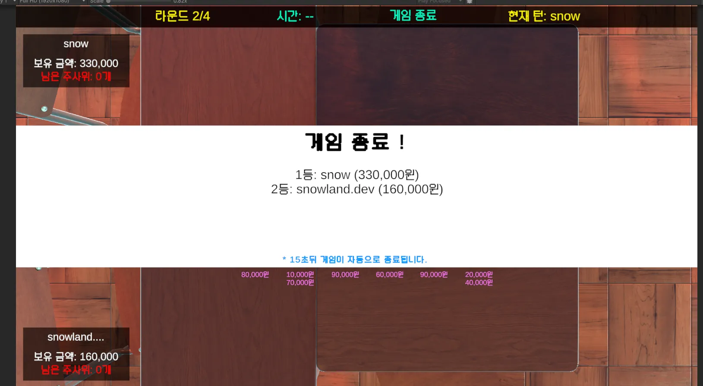
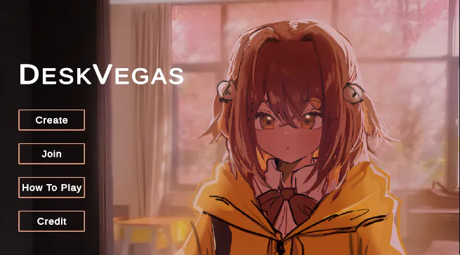

import Callout from '@/components/Callout.astro'

## 프로젝트 개요

DeskVegas는 **단 4일간의 개발로 완성한 3D 라스베가스 멀티플레이 보드게임**입니다. Unity 엔진과 [Mirror](https://github.com/MirrorNetworking/Mirror) 프레임워크를 기반으로 구축되었으며,
[Steamworks](https://github.com/rlabrecque/Steamworks.NET)를 이용한 Steam 플랫폼 통합을 통해 완전한 멀티플레이어 게임 경험을 제공합니다 !

## 개발 동기

이 프로젝트는 친구들이랑 보드게임장에서 보드게임을 하다가 너무 재밌어서 집에서도 같이 할 수 있게 게임을 만들어보는건 어떨까? 에서 시작되었습니다.

## 개발 일정

### 2025.06.16 | 네트워크 기반 핵심 코어 구현

<Callout variant="summary" title="2025.06.16 개발일지">
  - 게임 로비, 방 참가, 가입, 씬전환 완성
  - 게임 매니저 추가
  - 게임 플레이어 추가
  - 메인메뉴 UI 완성
  - 인게임 UI 완성
</Callout>

#### Steamworks를 이용한 게임 로비 시스템

```csharp title="Assets/Scripts/P2P/Steam/SteamLobbyService.cs" startLineNumber={28}
    public class SteamLobbyService : DontDestroySingleton<SteamLobbyService>
    {
        ...

        // Steam 콜백
        private Callback<LobbyCreated_t> _cbLobbyCreated;
        private Callback<LobbyMatchList_t> _cbMatchList;
        private Callback<LobbyEnter_t> _lobbyEnterCallback;
        private Callback<LobbyDataUpdate_t> _cbLobbyDataUpdated;

        ...

        private void CreateLobby(ELobbyType type) { }
        private void JoinLobby(CSteamID lobbyID) { }
        public void LeaveLobby() { }

        ...
    }
```

#### InGame UI 시스템

> 

---

### 2025.06.18 | 게임 로직 구현

<Callout variant="summary" title="2025.06.18 개발일지">
  - 주사위 던지는 기능 추가
  - 보드판에 돈 분배 기능 추가
  - 보드판 시스템 추가
  - 주사위 보드판에 배치 추가
  - 정산 시스템 추가
  - 턴 규칙 수정
  - Sync 오류 수정
  - etc
</Callout>

#### 물리 기반 주사위 시스템

```csharp title="Assets/Scripts/Dice/VegasDice.cs" startLineNumber={187}
    [Server]
    private void RollPhysically()
    {
        if (!_rb || _rb.isKinematic)
        {
            CustomLogger.LogWarning(LogCategory.System, $"주사위 {diceID} 물리 굴리기 실패 - Rigidbody가 null이거나 kinematic 상태", this);
            return;
        }

        // 물리 초기화
        ResetPhysics();

        Vector3 force = (Vector3.down + Random.onUnitSphere * 0.5f).normalized * 3f;
        _rb.AddForce(force, ForceMode.Impulse);

        // 랜덤 회전력
        Vector3 torque = new Vector3(
            Random.Range(MIN_TORQUE, MAX_TORQUE),
            Random.Range(MIN_TORQUE, MAX_TORQUE),
            Random.Range(MIN_TORQUE, MAX_TORQUE)
        );
        _rb.AddTorque(torque, ForceMode.Impulse);
    }
```

#### 보드판에 지폐 분배 시스템

```csharp title="Assets/Scripts/Board/VegasCasinoBoardManager.cs" startLineNumber={143}
    [Server]
    private void SetupCasinoBills(int casinoIndex)
    {
        var casinoBills = new List<BillCard>();
        int totalMoney = 0;

        while (totalMoney < minCasinoMoney && _billCardPool.Count > 0)
        {
            var card = _billCardPool[0];
            _billCardPool.RemoveAt(0);
            casinoBills.Add(card);
            totalMoney += card.GetActualAmount();
        }

        casino.SetBillCards(casinoBills);
    }
```

---

### 2025.06.20 ~ 2025.06.23 | 안정화 및 릴리즈

<Callout variant="summary" title="2025.06.19 Release v1.1.0">
  - isReady 확인하는 코드 추가
  - MainMenu - Lobby 에서 PlayerList 한글 이름 깨지는 오류 해결
  - InGameUI MaxRound 4로 고정되있는 오류 해결
  - 게임 종료 크래시 오류 해결
  - 게임 자동 종료 시간 변경 (15초 -> 10초)
  - 게임 자동 종료 카운트 다운 추가
  - 앣타망가짐님의 메인 메뉴 일러스트 추가
  - MainMenuUI 싹다 변경
  - 1턴당 120초 -> 60초로 수정
</Callout>

#### MainMenuUI 바뀐 모습

> 

<Callout variant="summary" title="2025.06.23 Release v1.2.0">
  - 이모지 시스템 추가
  - 배경음악 시스템 추가
  - 주사위 배치 시스템 2줄 -> 3줄 수정
</Callout>

<Callout variant="summary" title="2025.06.23 Release v1.3.0">
  - 핑크색 주사위 하이라이트 오류 수정
  - 디스코드 매니저 추가
</Callout>

## 핵심 기술 문제 해결

### Mirror의 씬 전환 문제

<Callout variant="problem">
  **문제 상황**: 다른 씬으로 넘어갈때 호스트가 클라이언트 준비를 안 기다리고 게임을 시작하는 문제가 발생했습니다.

Ex: 메인메뉴씬에서 인게임씬으로 넘어갈때

</Callout>

<Callout variant="solution">

**클라이언트가 호스트에게 준비됬다고 알려주기**

```csharp title="Assets/Scripts/P2P/SceneReadyManager.cs" startLineNumber={127}
[Command(requiresAuthority = false)]
private void NotifyServerSceneReady(NetworkConnectionToClient sender = null)
{
    if (_isSceneCheckComplete)
    {
        CustomLogger.LogVerbose(LogCategory.Network, $"씬 체크가 이미 완료됨 - 클라이언트 {sender.connectionId} 늦은 응답", this);
        TargetConfirmNotificationReceived(sender);
        return;
    }
    if (!_readyClients.Add(sender))
    {
        CustomLogger.LogVerbose(LogCategory.Network, $"클라이언트 {sender.connectionId}는 이미 Ready 상태로 등록됨", this);
        TargetConfirmNotificationReceived(sender);
        return;
    }

    CustomLogger.LogInfo(LogCategory.Network, $"클라이언트 {sender.connectionId} 씬 준비 완료 등록! ({_readyClients.Count}/{_expectedClientCount} 준비됨)", this);

    TargetConfirmNotificationReceived(sender);
    CheckAllClientsReady();
}
```

</Callout>

인게임 씬으로 이동하면 호스트는 일정 시간 동안 `NetworkServer.connections.Count - 1` 호스트를 제외한 클라이언트들한테 요청을 받을때까지
기다린다음 다 받으면 `GameEvents.Network.OnSceneLoaded?.Invoke();`을 이용하여 게임을 시작하게 만들었습니다.

### Mirror의 Sync 값 동기화 순서 문제

개발 중 가장 복잡했던 문제는 **ClientRpc와 SyncVar 간의 동기화 타이밍 불일치**였습니다.

<Callout variant="problem">
  **문제 상황**: ClientRpc 메시지가 SyncVar 업데이트보다 먼저 클라이언트에 도착하여, 
  클라이언트가 이전 상태 값을 참조하게 되는 문제가 발생했습니다.

예를 들어, 턴이 Player 1에서 Player 2로 넘어갈 때:

1. 서버에서 `currentPlayerIndex` SyncVar를 2로 업데이트
2. 서버에서 `RpcOnCurrentPlayerChanged()` ClientRpc 호출
3. 클라이언트에서 ClientRpc가 먼저 실행되어 여전히 `currentPlayerIndex = 1`을 읽음
</Callout>

<Callout variant="solution">

**Sync 값 말고 직접 전달하기**

```csharp title="Assets/Scripts/Core/VegasGameManager.cs" startLineNumber={530} ins={8-15} del={1-6} ins="added" del="deleted"
[ClientRpc]
private void RpcOnCurrentPlayerChanged()
{
    // currentPlayerIndex SyncVar가 아직 업데이트되지 않을 수 있음
    GameEvents.VegasGame.OnCurrentPlayerChanged?.Invoke(currentPlayerIndex);
}

[ClientRpc]
private void RpcOnCurrentPlayerChanged(int newPlayerIndex)
{
    currentPlayerIndex = newPlayerIndex;

    // 서버에서 직접 전달받은 값 사용
    GameEvents.VegasGame.OnCurrentPlayerChanged?.Invoke(newPlayerIndex);
}
```

</Callout>
